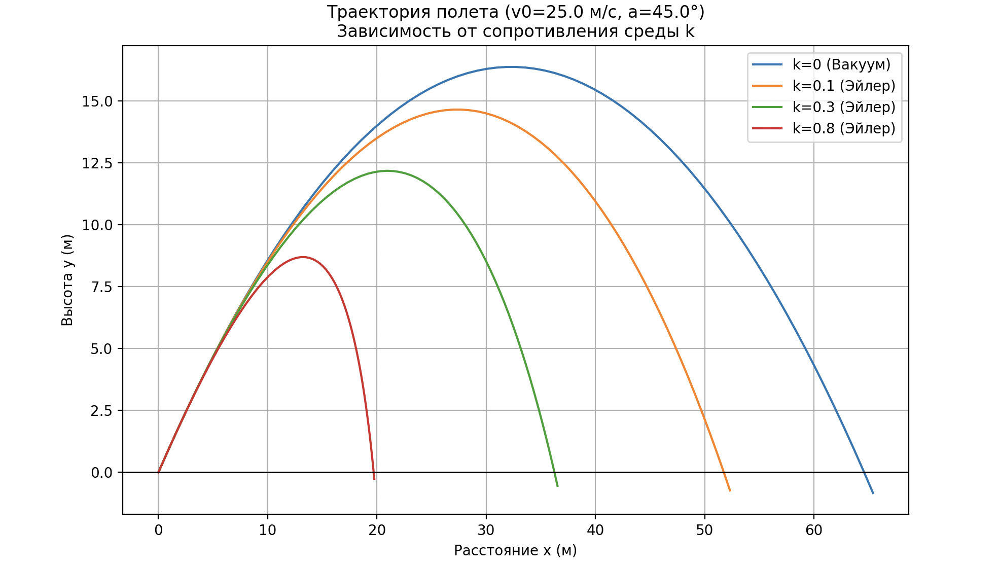
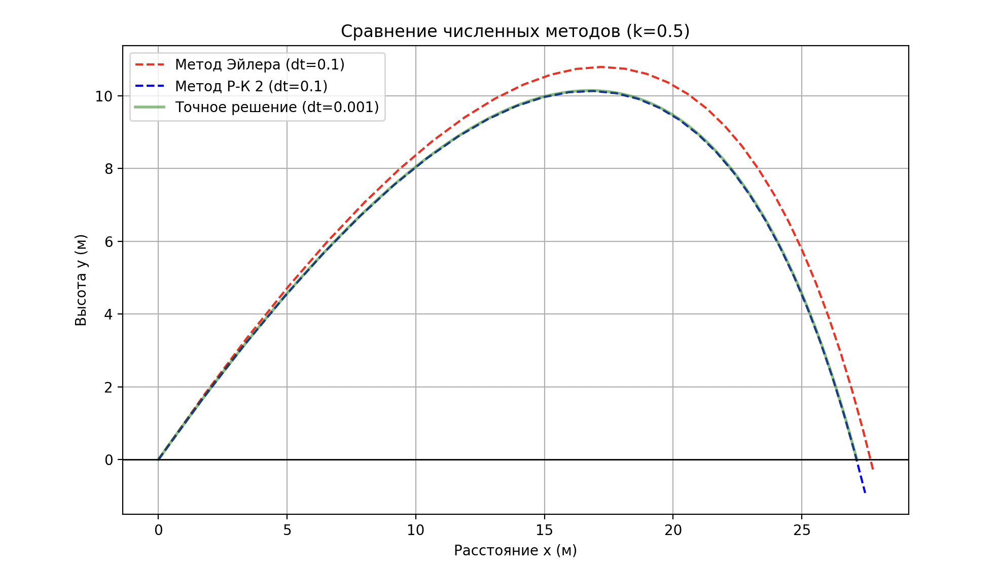

# Моделирование движения тела, брошенного под углом к горизонту с учетом сопротивления воздуха

Этот проект представляет собой численное моделирование траектории полета тела, брошенного под углом к горизонту, с учетом и без учета сопротивления воздуха. Реализованы два метода численного интегрирования: метод Эйлера и метод Рунге-Кутты 2-го порядка.

## Описание

Программа моделирует движение тела в двумерном пространстве с учетом следующих сил:
- Сила тяжести (g = 9.81 м/с²)
- Сила сопротивления воздуха, пропорциональная скорости (F = -k·v)

## Требования

Для работы программы необходимо установить:
- Python 3.x
- NumPy
- Matplotlib

Установка зависимостей:
```bash
pip install numpy matplotlib
```

## Использование

1. Запустите скрипт:
```bash
python prog.py
```

2. Программа отобразит два графика:
   - Первый график показывает траектории полета при разных коэффициентах сопротивления воздуха (k) с использованием метода Эйлера
   - Второй график сравнивает точность методов Эйлера и Рунге-Кутты 2-го порядка при высоком коэффициенте сопротивления

## Параметры модели

В коде можно изменить следующие параметры:
- `v0` - начальная скорость (м/с)
- `angle` - угол броска (градусы)
- `h0` - начальная высота (м)
- `k_values` - массив коэффициентов сопротивления воздуха (1/с)
- `dt` - шаг интегрирования (с)

## Методы интегрирования

1. **Метод Эйлера** (`model_step_euler`)
   - Простой метод первого порядка точности
   - Быстрый, но менее точен при больших шагах интегрирования

2. **Метод Рунге-Кутты 2-го порядка** (`model_step_rk2`)
   - Более точный метод второго порядка
   - Лучше справляется с большими шагами интегрирования

## Примеры выходных данных

Программа генерирует графики, показывающие:
1. Зависимость траектории от коэффициента сопротивления воздуха
2. Сравнение точности методов при большом шаге интегрирования

## Примечания

- При увеличении коэффициента сопротивления воздуха (k) дальность полета уменьшается
- Метод Рунге-Кутты демонстрирует лучшую точность при одинаковом шаге интегрирования
- Для получения более точных результатов уменьшите шаг интегрирования (`dt`)





